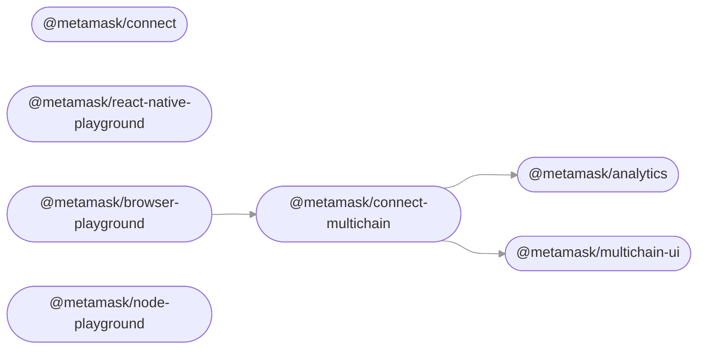

# MetaMask Connect Monorepo

This monorepo is a collection of packages used for MetaMask Connect, a unified connection experience that aims towards delivering multichain functionality, persistent sessions, and abstracted transactions while preserving backwards compatibility with MetaMask SDK.

## Contributing

See the [Contributor Guide](./docs/contributing.md) for help on:

- Setting up your development environment
- Working with the monorepo
- Testing changes a package in other projects
- Issuing new releases
- Creating a new package

## Packages

<!-- start package list -->

- [`@metamask/analytics`](packages/analytics)
- [`@metamask/connect`](packages/connect)
- [`@metamask/connect-multichain`](packages/connect-multichain)
- [`@metamask/node-playground`](playground/node-playground)
- [`@metamask/browser-playground`](playground/browser-playground)
- [`@metamask/react-native-playground`](playground/react-native-playground)
- [`@metamask/multichain-ui`](packages/multichain-ui)

<!-- end package list -->

<!-- start dependency graph -->

<!-- end dependency graph -->

(This section may be regenerated at any time by running `yarn update-readme-content`.)
