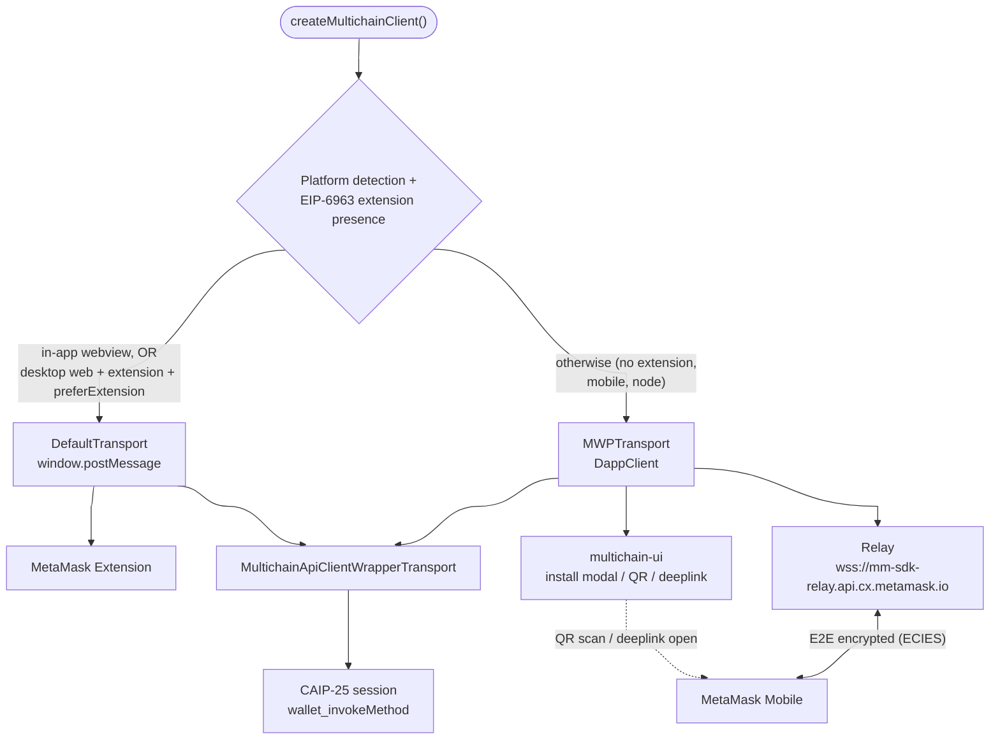
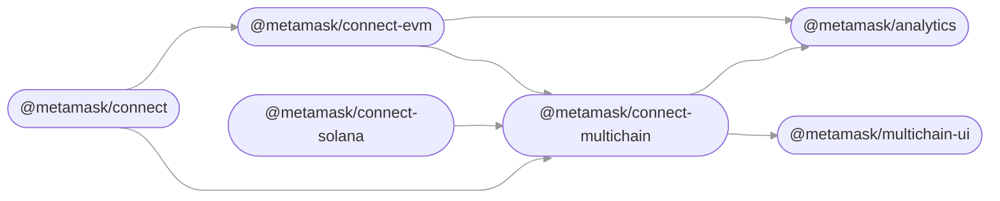

# MetaMask Connect

A unified SDK for dApps to connect to MetaMask across all platforms and ecosystems. MetaMask Connect replaces the [previous MetaMask SDK](https://github.com/MetaMask/metamask-sdk) with a ground-up rewrite built on the [CAIP-25 Multichain API](https://github.com/MetaMask/metamask-improvement-proposals/blob/main/MIPs/mip-5.md).

A single integration handles:

- **Desktop browser with MetaMask Extension installed** — communicates directly with the extension
- **Desktop browser without MetaMask Extension installed** — connects to MetaMask Mobile via QR code + relay
- **Mobile native browser (Safari, Chrome, etc.)** — connects to MetaMask Mobile via deeplink + relay
- **In-app browser (inside MetaMask Mobile)** — direct bridge, no relay needed
- **React Native apps** — deeplink + relay to MetaMask Mobile

MetaMask Connect automatically determines the right transport and abstracts platform-specific details behind a unified interface.

## Why not just EIP-6963?

[EIP-6963](https://eips.ethereum.org/EIPS/eip-6963) solves wallet discovery — it lets dApps find which wallets are available as injected providers. That's useful, but it only works when the MetaMask Extension is present in the same browser.

MetaMask Connect gives you:

1. **Remote connections** when the MetaMask Extension isn't installed — mobile wallet connections via relay, replacing WalletConnect for MetaMask-specific flows with better stability and UX
2. **Multichain session management** — request access to EVM + Solana (+ future ecosystems) in a single session, instead of connecting per-chain
3. **Automatic session persistence** — sessions survive page reloads and new tabs without re-prompting the user
4. **Cross-platform consistency** — same API whether connecting to MetaMask Extension or MetaMask Mobile

## The Multichain API

MetaMask Connect is built on the [CASA Multichain API (CAIP-25)](https://github.com/ChainAgnostic/CAIPs/blob/main/CAIPs/caip-25.md), a chain-agnostic standard for wallet–dApp communication. For the full rationale, see [MIP-5](https://github.com/MetaMask/metamask-improvement-proposals/blob/main/MIPs/mip-5.md).

Instead of the traditional EIP-1193 model (`eth_requestAccounts` on one chain at a time), the Multichain API lets dApps:

- **Request permissions across ecosystems in one call** — e.g., "I need Ethereum Mainnet, Polygon, and Solana Mainnet" as a single session request
- **Invoke methods on any permitted scope** — send a Solana transaction and an EVM transaction through the same session
- **Use standardized session lifecycle** — `wallet_createSession`, `wallet_invokeMethod`, `wallet_getSession`, `wallet_revokeSession`

This means a dApp that supports both EVM and Solana doesn't need separate connection flows — one session covers both.

## Integration Options

There are two ways to integrate, depending on how much you want to adopt:

### Option A: Ecosystem-Specific Clients (drop-in)

Use [`@metamask/connect-evm`](packages/connect-evm) and/or [`@metamask/connect-solana`](packages/connect-solana) for a familiar developer experience with minimal changes to your existing code.

#### EVM

Provides an **EIP-1193 compatible provider** so your existing EVM code works with minimal changes.

```typescript
import { createEVMClient } from '@metamask/connect-evm';

const client = await createEVMClient({
  dapp: { name: 'My DApp', url: 'https://mydapp.com' },
});

const { accounts, chainId } = await client.connect({
  chainIds: ['0x1', '0x89'], // Ethereum Mainnet + Polygon
});

// Get an EIP-1193 provider — works with ethers.js, viem, web3.js, etc.
const provider = client.getProvider();
const balance = await provider.request({
  method: 'eth_getBalance',
  params: [accounts[0], 'latest'],
});
```

#### Solana

Provides a [Wallet Standard](https://github.com/wallet-standard/wallet-standard) compatible wallet, so it integrates with the Solana wallet adapter ecosystem.

```typescript
import { createSolanaClient } from '@metamask/connect-solana';

const client = await createSolanaClient({
  dapp: { name: 'My DApp', url: 'https://mydapp.com' },
  api: {
    supportedNetworks: {
      mainnet: 'https://api.mainnet-beta.solana.com',
      devnet: 'https://api.devnet.solana.com',
    },
  },
});
// MetaMask auto-registers with Wallet Standard during initialization.
```

MetaMask appears as a Solana wallet in any dApp using `@solana/wallet-adapter`. Users connect the same way they would with Phantom or Solflare.

#### Using both together

If your dApp supports EVM and Solana, you can use both clients. They share the same underlying multichain session — the user only approves once.

### Option B: Multichain Client (full API)

Use [`@metamask/connect-multichain`](packages/connect-multichain) directly for the full Multichain API experience. This is more powerful but requires adapting your dApp to work with scopes and `wallet_invokeMethod` rather than traditional per-chain RPC.

```typescript
import { createMultichainClient } from '@metamask/connect-multichain';

const client = await createMultichainClient({
  dapp: { name: 'My DApp', url: 'https://mydapp.com' },
});

// Connect with scopes across ecosystems
await client.connect(
  ['eip155:1', 'eip155:137', 'solana:5eykt4UsFv8P8NJdTREpY1vzqKqZKvdp'],
  [],
);

// Invoke methods on any scope
const ethBalance = await client.invokeMethod({
  scope: 'eip155:1',
  request: { method: 'eth_getBalance', params: ['0x...', 'latest'] },
});

const solanaSignature = await client.invokeMethod({
  scope: 'solana:5eykt4UsFv8P8NJdTREpY1vzqKqZKvdp',
  request: {
    method: 'signMessage',
    params: {
      account: { address: 'YourSolanaAddress' },
      message: 'SGVsbG8gZnJvbSBTb2xhbmE=', // "Hello from Solana" in base64
    },
  },
});
```

Full control over the multichain session. Request exactly the scopes you need, invoke methods on any chain, and handle events for cross-chain flows. This is the path that unlocks the best UX for multichain dApps — a single connection prompt for all ecosystems — but it does require your dApp to work with the Multichain API's scope model rather than per-chain RPC providers.

### Which option should I choose?

|                        | Ecosystem Clients (Option A)                                               | Multichain Client (Option B)                                            |
| ---------------------- | -------------------------------------------------------------------------- | ----------------------------------------------------------------------- |
| **Integration effort** | Low — drop-in replacement for existing provider code                       | Medium — requires adapting to scope-based API                           |
| **EVM support**        | EIP-1193 provider, works with ethers/viem/web3.js                          | Via `wallet_invokeMethod` with `eip155:`\* scopes                       |
| **Solana support**     | Wallet Standard, works with Solana wallet adapter                          | Via `wallet_invokeMethod` with `solana:`\* scopes                       |
| **Cross-chain UX**     | Separate connect flows per ecosystem                                       | Single connect prompt for all ecosystems                                |
| **Session management** | Handled automatically per-client                                           | Full control over unified session                                       |
| **Best for**           | Existing dApps wanting MetaMask Connect benefits with minimal code changes | New or multichain-native dApps wanting the best possible cross-chain UX |

You can also **start with Option A and migrate to Option B** incrementally. The ecosystem clients are wrappers around the multichain client — they use the same transport, session, and relay infrastructure under the hood.

## How Connections Work Under the Hood

1. **Platform detection** — SDK checks if MetaMask Extension is present, what browser you're in, whether you're on mobile, etc.
2. **Transport selection** — MetaMask Extension present? Direct messaging. Not present? Relay connection via QR code or deeplink.
3. **Session creation** — CAIP-25 session established with the requested scopes (chains + methods).
4. **E2E encryption** — Relay connections are end-to-end encrypted (ECIES). The relay server never sees message content.
5. **Session persistence** — Session survives reloads. User doesn't need to re-approve on page refresh.

## Architecture

MetaMask Connect is layered: `@metamask/connect-multichain` is the CAIP-25 core that manages
the session and negotiates transports, the EVM and Solana adapters wrap it for ecosystem-specific
APIs, and `@metamask/connect` re-exports the core (default) and the EVM adapter (`/evm`). At
connect time the core detects the platform and selects a transport — direct messaging to the
extension, or the Mobile Wallet Protocol relay for QR/deeplink connections to MetaMask Mobile:


```mermaid
%%{ init: { 'flowchart': { 'curve': 'bumpX' } } }%%
graph TD;
  start(["createMultichainClient()"]) --> detect{"Platform detection +<br/>EIP-6963 extension presence"};
  detect -->|"in-app webview, OR<br/>desktop web + extension + preferExtension"| direct["DefaultTransport<br/>window.postMessage"];
  detect -->|"otherwise (no extension,<br/>mobile, node)"| mwp["MWPTransport<br/>DappClient"];
  direct --> ext["MetaMask Extension"];
  mwp --> ui["multichain-ui<br/>install modal / QR / deeplink"];
  mwp --> relay["Relay<br/>wss://mm-sdk-relay.api.cx.metamask.io"];
  ui -.->|"QR scan / deeplink open"| mobile["MetaMask Mobile"];
  relay <-->|"E2E encrypted (ECIES)"| mobile;
  direct --> wrapper["MultichainApiClientWrapperTransport"];
  mwp --> wrapper;
  wrapper --> session["CAIP-25 session<br/>wallet_invokeMethod"];
```

See [`docs/architecture.md`](./docs/architecture.md) for the full package topology and a
detailed walk-through of transport selection, session persistence, and headless mode.

## Getting Started

```bash
# For EVM dApps
npm install @metamask/connect-evm

# For Solana dApps
npm install @metamask/connect-solana

# For full multichain control
npm install @metamask/connect-multichain
```

## Content Security Policy

Host pages integrating MetaMask Connect need to allow a few origins in their [Content Security Policy](https://developer.mozilla.org/en-US/docs/Web/HTTP/CSP).

### Required

```
connect-src wss://mm-sdk-relay.api.cx.metamask.io;
img-src data:;
```

- `wss://mm-sdk-relay.api.cx.metamask.io` — the WebSocket URL of the MetaMask relay used for remote connections (mobile, no-extension, etc.). Unavoidable — the relay cannot be proxied or deferred from within the library, and remote connections will fail without it.
- `img-src data:` — the install/QR-code modal in `@metamask/multichain-ui` embeds the MetaMask fox SVG as a `data:` URI inside the generated QR code. Without this, the QR code will fail to render entirely.

### Also consider

- **`https://mm-sdk-analytics.api.cx.metamask.io`** — telemetry endpoint used by `@metamask/analytics` when analytics are enabled. Analytics are enabled by default; set `analytics.enabled: false` to disable analytics events and omit this endpoint from `connect-src`.
- **`style-src 'unsafe-inline'`** — `@metamask/multichain-ui` is built with [Stencil](https://stenciljs.com/), which injects component styles at runtime inside Shadow DOM. Strict CSPs without `'unsafe-inline'` (or an equivalent nonce/hash strategy) may break modal styling.
- **RPC endpoints you pass to `api.infuraProjectId` / `api.readonlyRPCMap` / `supportedNetworks`** — e.g. `https://*.infura.io`, your own node provider, or a public RPC. These are supplied by your dApp, so add whatever `connect-src` entries match the endpoints you configure.
- **`https://metamask.app.link` and `metamask://`** — used for mobile deeplinks / universal links. These are top-level navigations and are not normally subject to `connect-src`, but strict CSPs that use `navigate-to` or `form-action` may need to allow them.

### Minimal example

For a dApp using the default analytics endpoint, Infura, and the install modal:

```
connect-src 'self' wss://mm-sdk-relay.api.cx.metamask.io https://mm-sdk-analytics.api.cx.metamask.io https://*.infura.io;
img-src 'self' data:;
style-src 'self' 'unsafe-inline';
```

See [`playground/browser-playground/public/index.html`](./playground/browser-playground/public/index.html) for a working reference CSP.

## Packages

The published libraries under `packages/`. This table is generated from the workspace
metadata — run `yarn update-readme-content` to regenerate it.

<!-- start package list -->

| Package                                                       | npm                                                               | Description                                                                                                    |
| ------------------------------------------------------------- | ----------------------------------------------------------------- | -------------------------------------------------------------------------------------------------------------- |
| [`@metamask/analytics`](packages/analytics)                   | [npm](https://www.npmjs.com/package/@metamask/analytics)          | MetaMask Connect telemetry — batched connection-lifecycle events                                               |
| [`@metamask/connect`](packages/connect)                       | [npm](https://www.npmjs.com/package/@metamask/connect)            | Unified entry point for MetaMask Connect — re-exports the multichain core (default) and the EVM adapter (/evm) |
| [`@metamask/connect-evm`](packages/connect-evm)               | [npm](https://www.npmjs.com/package/@metamask/connect-evm)        | MetaMask Connect EVM adapter — EIP-1193 provider over the multichain core                                      |
| [`@metamask/connect-multichain`](packages/connect-multichain) | [npm](https://www.npmjs.com/package/@metamask/connect-multichain) | MetaMask Connect core — CAIP multichain API, session management, and transport negotiation                     |
| [`@metamask/connect-solana`](packages/connect-solana)         | [npm](https://www.npmjs.com/package/@metamask/connect-solana)     | MetaMask Connect Solana adapter — Wallet Standard integration over the multichain core                         |
| [`@metamask/multichain-ui`](packages/multichain-ui)           | [npm](https://www.npmjs.com/package/@metamask/multichain-ui)      | MetaMask Connect UI — install modal, OTP modal, and QR codes                                                   |

<!-- end package list -->

### Playgrounds

Local test apps (not published). Maintained by hand.

| Package                                                                   | Description                                                         |
| ------------------------------------------------------------------------- | ------------------------------------------------------------------- |
| [`@metamask/browser-playground`](playground/browser-playground)           | Browser test dApp — React app for multichain, legacy EVM, and wagmi |
| [`@metamask/node-playground`](playground/node-playground)                 | Node.js CLI playground — Inquirer-based with terminal QR codes      |
| [`@metamask/playground-ui`](playground/playground-ui)                     | Shared playground logic — constants, helpers, and types             |
| [`@metamask/react-native-playground`](playground/react-native-playground) | React Native test dApp — Expo app for mobile testing                |

### Dependency graph

Generated from the published-package workspace dependencies (run
`yarn update-readme-content` to regenerate). For the full topology including the
playgrounds and transports, see [`docs/architecture.md`](./docs/architecture.md).

<!-- start dependency graph -->


```mermaid
%%{ init: { 'flowchart': { 'curve': 'bumpX' } } }%%
graph LR;
linkStyle default opacity:0.5
  analytics(["@metamask/analytics"]);
  connect(["@metamask/connect"]);
  connect_evm(["@metamask/connect-evm"]);
  connect_multichain(["@metamask/connect-multichain"]);
  connect_solana(["@metamask/connect-solana"]);
  multichain_ui(["@metamask/multichain-ui"]);
  connect --> connect_evm;
  connect --> connect_multichain;
  connect_evm --> analytics;
  connect_evm --> connect_multichain;
  connect_multichain --> analytics;
  connect_multichain --> multichain_ui;
  connect_solana --> connect_multichain;
```

<!-- end dependency graph -->

## Security Audits

MetaMask Connect has been independently audited. Reports are stored in the [`audits/`](./audits) directory.

| Auditor                     | Report                                                      | Date       | Scope                                                                                                                                                                                                                                                              | Findings                                                                                       |
| --------------------------- | ----------------------------------------------------------- | ---------- | ------------------------------------------------------------------------------------------------------------------------------------------------------------------------------------------------------------------------------------------------------------------ | ---------------------------------------------------------------------------------------------- |
| [Cyfrin](https://cyfrin.io) | [PDF](./audits/2026-03-05-cyfrin-metamask-connect-v2.0.pdf) | March 2026 | Cryptographic implementation (ECIES, key management), session management, transport layer security, input validation, third-party dependency review across `connect-monorepo`, `mobile-wallet-protocol`, `metamask-mobile`, `metamask-extension`, and relay server | 14 issues (0 critical, 1 high, 5 medium, 5 low, 3 informational) — 12 resolved, 2 acknowledged |

## Contributing

See the [Contributor Guide](./docs/contributing.md) for help on:

- Setting up your development environment
- Working with the monorepo
- Testing changes a package in other projects
- Issuing new releases
- Creating a new package
