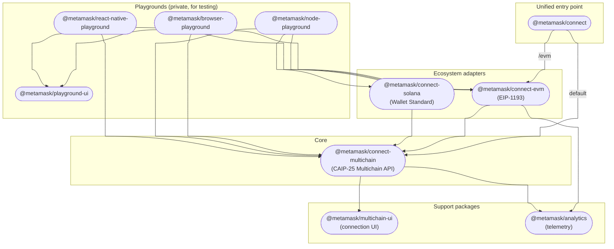
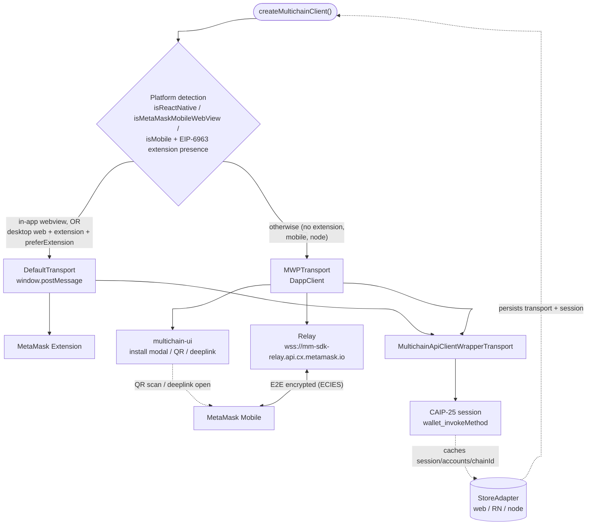

# Architecture

This document describes how the packages in `connect-monorepo` fit together and how
`@metamask/connect` composes its sub-packages and transports. For per-package API details,
see each package's own README.

## Package topology

MetaMask Connect is layered. `@metamask/connect-multichain` is the core: it speaks the
CAIP-25 Multichain API, manages the session, and negotiates transports. The ecosystem
adapters (`connect-evm`, `connect-solana`) wrap the core to expose familiar,
ecosystem-specific surfaces (EIP-1193 and Wallet Standard). `@metamask/connect` is a thin
unified entry point that re-exports the core (default) and the EVM adapter (`/evm`).

> The canonical, auto-generated dependency graph of the **published** packages lives in the
> [root README](../README.md#packages). This diagram adds the private playgrounds and the
> conceptual layering for context.

Key points:

- **One session, many ecosystems.** The EVM and Solana adapters both drive the same
  underlying `MultichainCore` instance, so a dapp using both shares a single CAIP-25
  session — the user approves once. `createMultichainClient` is a singleton per global
  context.
- **Adapters are optional.** A dapp can use `@metamask/connect-multichain` directly for the
  full scope-based API, or an adapter for a drop-in EIP-1193 / Wallet Standard experience.
- **Support packages are internal.** `multichain-ui` (connection UI) and `analytics`
  (telemetry) are pulled in transitively by the core; dapps rarely import them directly.

## Transport selection and composition

When a dapp calls `connect()`, the multichain core detects the platform, picks a transport,
and routes all RPC through a uniform wrapper. Two concrete transports exist:

- **`DefaultTransport`** — direct messaging to the MetaMask **extension** via
  `window.postMessage` (the `metamask-contentscript` channel). Used when the extension is
  present (or inside the MetaMask mobile in-app browser).
- **`MWPTransport`** — remote connection to **MetaMask Mobile** over the Mobile Wallet
  Protocol. A `DappClient` connects through the relay
  (`wss://mm-sdk-relay.api.cx.metamask.io`); the dapp shows a QR code (desktop) or deeplink
  (mobile web / React Native) via `multichain-ui`, the wallet scans/opens it, and an
  end-to-end encrypted session is established.

Both are fronted by `MultichainApiClientWrapperTransport`, which exposes the
`wallet_createSession` / `wallet_getSession` / `wallet_revokeSession` / `wallet_invokeMethod`
surface to the rest of the SDK.

Notes:

- **Platform entry points.** The core ships three builds — `index.browser.ts`,
  `index.native.ts`, `index.node.ts` — that differ only in their UI modals
  (`web` / `rn` / `node`) and storage adapter (`localStorage` / AsyncStorage / filesystem).
- **Resumption.** The selected transport type and session data are persisted via the
  platform `StoreAdapter`, so a connection survives page reloads without re-prompting. On
  load the core checks the stored transport (and, for the extension path, re-verifies
  extension presence) before resuming.
- **Headless mode.** With `ui.headless: true`, the core skips `multichain-ui` and emits
  `display_uri` events so the dapp can render its own QR code.
- **Telemetry.** Connection events are reported through `@metamask/analytics` with a
  `transport_type` of `direct` (extension), `websocket`, or `deeplink` — unless
  `analytics.enabled` is `false`.

## Further reading

- [Root README](../README.md) — integration options, getting started, CSP requirements.
- [`@metamask/connect-multichain`](../packages/connect-multichain/README.md) — core API and
  the CAIP standards it implements.
- [`@metamask/connect-evm`](../packages/connect-evm/README.md) /
  [`@metamask/connect-solana`](../packages/connect-solana/README.md) — adapter APIs.
- [`@metamask/multichain-ui`](../packages/multichain-ui/README.md) — connection UI components.
- [`@metamask/analytics`](../packages/analytics/README.md) — telemetry.
