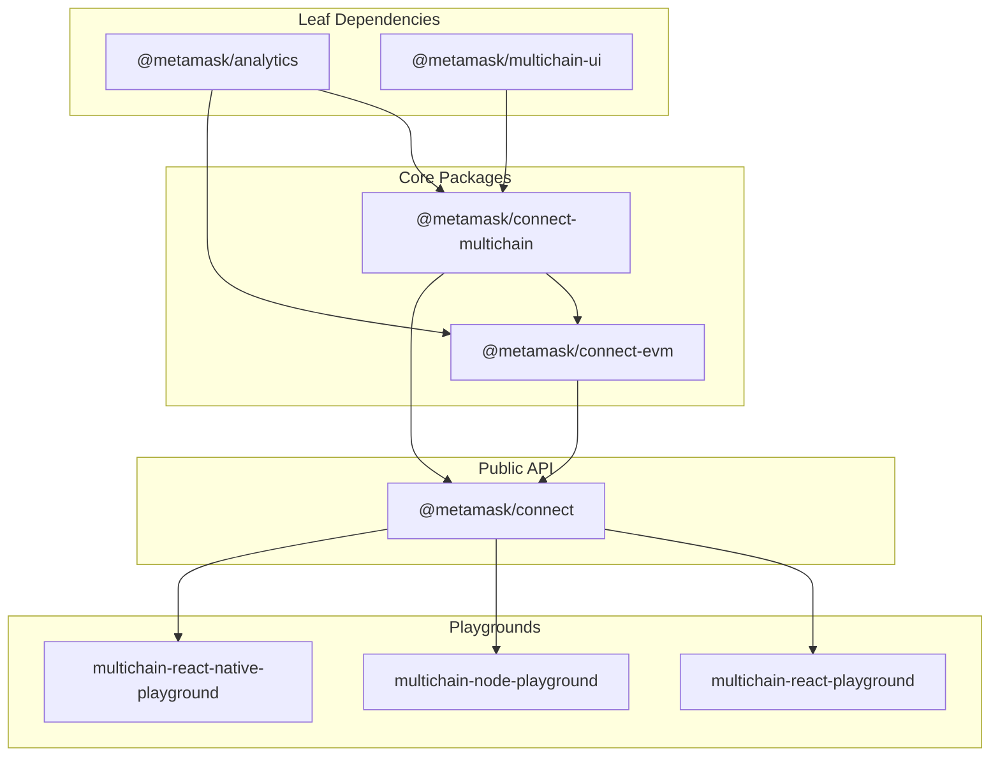
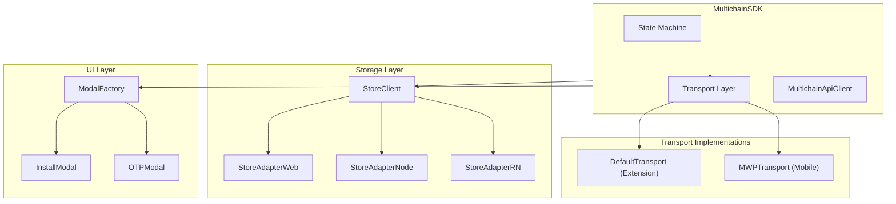
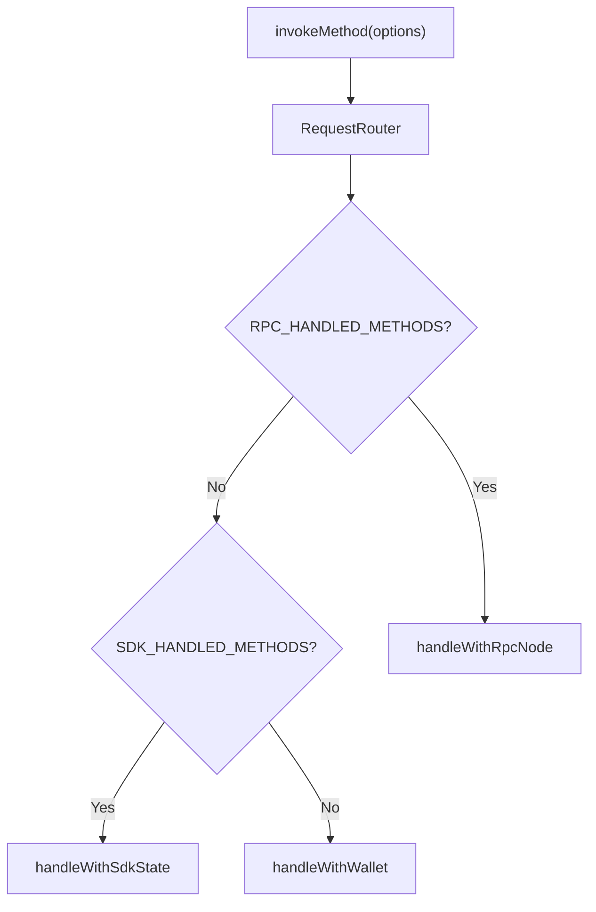
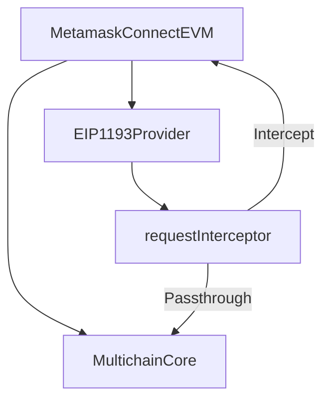
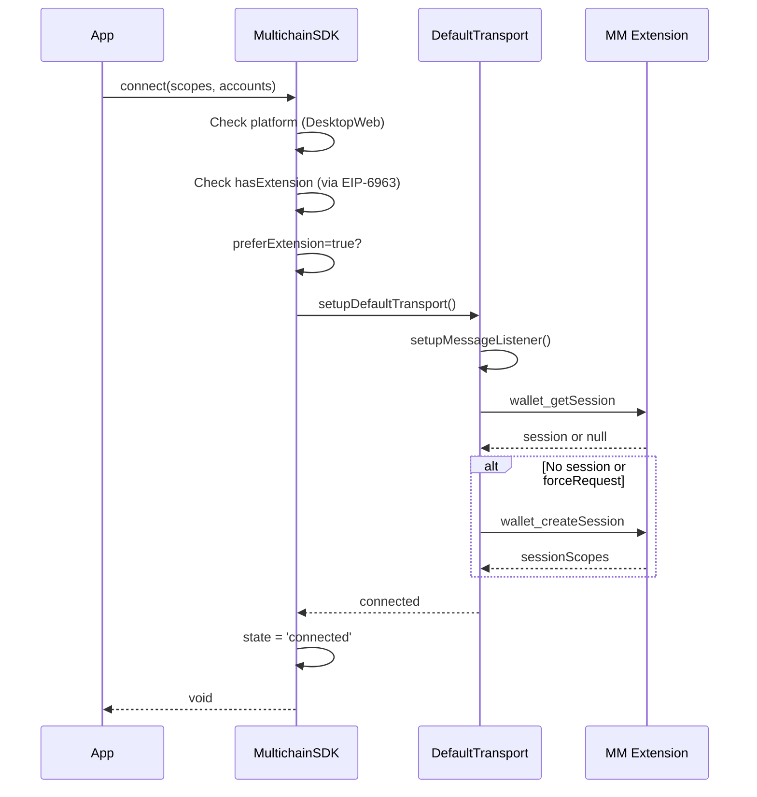
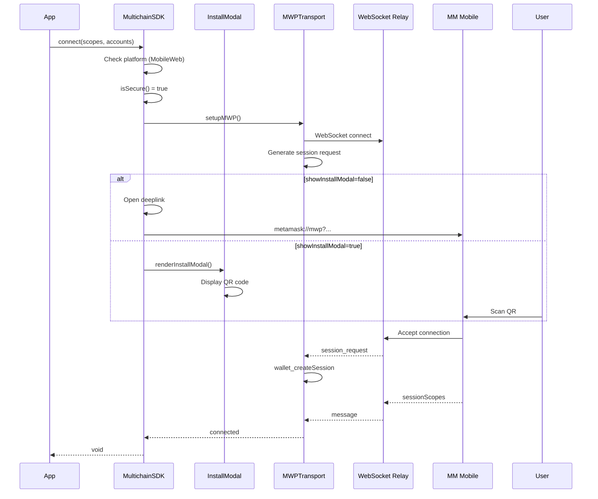
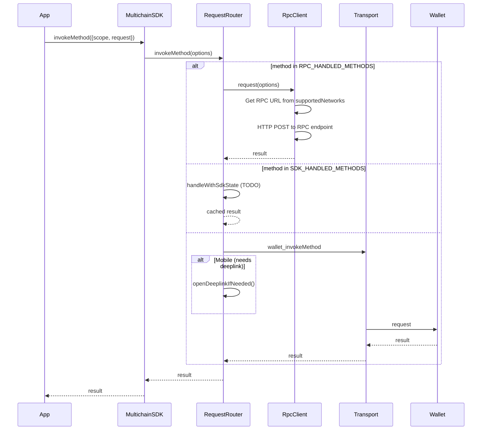

# MetaMask Connect Architecture

This document provides a comprehensive architectural overview of the MetaMask Connect Monorepo, capturing package responsibilities, interfaces, data flows, and non-obvious behaviors.

## Package Dependency Graph



**Correct Dependency Order (Bottom-Up):**
1. `@metamask/analytics` — Leaf
2. `@metamask/multichain-ui` — Leaf
3. `@metamask/connect-multichain` — Depends on analytics + multichain-ui
4. `@metamask/connect-evm` — Depends on analytics + connect-multichain
5. `@metamask/connect` — Facade re-exporting multichain + evm

---

## Package Deep-Dives

### 1. @metamask/analytics

**Purpose:** Send telemetry events to MetaMask's analytics API.

**Architecture:**
- `Analytics` class: Main entry point, wraps a `Sender`, disabled by default
- `Sender` class: Generic batching sender with exponential backoff
- `schema.ts`: Auto-generated OpenAPI types from API spec

**Public API:**
```typescript
const analytics = client;  // Singleton export

analytics.enable();  // Must be called to start sending
analytics.setGlobalProperty(key, value);  // Set persistent properties
analytics.track(eventName, properties);  // Queue an event
```

**Key Behaviors & Gotchas:**
- **Disabled by default** — Must explicitly call `.enable()` or events are silently dropped
- **Batching** — Events batch up to 100 items, flushed every 200ms
- **Exponential backoff** — On send failure, backs off up to 30s max
- **Environment detection** — Reads `METAMASK_ANALYTICS_ENDPOINT` or `NEXT_PUBLIC_METAMASK_ANALYTICS_ENDPOINT` from env

**Endpoint:** `https://mm-sdk-analytics.api.cx.metamask.io/v2/events`

---

### 2. @metamask/multichain-ui

**Purpose:** Stencil web components for connection UI modals.

**Components:**
- `<mm-install-modal>` — QR code modal for mobile connection + extension install button
- `<mm-otp-modal>` — OTP verification modal for secure pairing
- `<widget-wrapper>` — Styling wrapper with Euclid Circular B font

**Key Props:**
```typescript
// mm-install-modal
link: string;           // QR code URL
expiresIn: number;      // QR expiration countdown
showInstallModal: boolean;  // Extension-first vs mobile-first layout
sdkVersion?: string;

// mm-otp-modal
displayOTP?: boolean;
otpCode: string;
sdkVersion?: string;
```

**Events Emitted:**
- `close` — User dismissed modal
- `startDesktopOnboarding` — User clicked extension install
- `disconnect` — User clicked disconnect in OTP modal

**Key Behaviors & Gotchas:**
- **Shadow DOM** — Components use shadow DOM, CSS isolation
- **i18n** — Uses `SimpleI18n` for translations, async loading
- **QR regeneration** — Watches `link` prop, regenerates QR on change

---

### 3. @metamask/connect-multichain

**Purpose:** Core SDK for multichain wallet connections. This is the heart of the system.

**Entry Points (Environment-Specific):**
```typescript
// Browser
import { createMetamaskConnect } from '@metamask/connect-multichain';

// Node.js
import { createMetamaskConnect } from '@metamask/connect-multichain';

// React Native
import { createMetamaskConnect } from '@metamask/connect-multichain';
```

Each entry point auto-selects the correct:
- **Storage adapter** (IndexedDB/localStorage for web, AsyncStorage for RN, file for Node)
- **UI modals** (web components for browser, console for node, custom for RN)

**Core Architecture:**



**Public API:**
```typescript
interface MultichainCore {
  state: SDKState;  // 'pending' | 'loaded' | 'connecting' | 'connected' | 'disconnected'
  storage: StoreClient;
  provider: MultichainApiClient<RPCAPI>;
  transport: ExtendedTransport;
  transportType: TransportType;  // 'browser' | 'mwp'
  
  connect(scopes: Scope[], caipAccountIds: CaipAccountId[], forceRequest?: boolean): Promise<void>;
  disconnect(): Promise<void>;
  invokeMethod(options: InvokeMethodOptions): Promise<Json>;
  openDeeplinkIfNeeded(): void;
}
```

**Transport Types:**

| Transport | When Used | How It Works |
|-----------|-----------|--------------|
| `DefaultTransport` | Extension installed + preferExtension=true | Uses `window.postMessage` to extension content script |
| `MWPTransport` | Mobile web, React Native, extension not preferred | Mobile Wallet Protocol via WebSocket relay |

**State Machine:**
```
pending → loaded → connecting → connected
                      ↓            ↓
                disconnected ← ─ ─ ─
```

**Request Routing:**



- **RPC_HANDLED_METHODS** — Read-only methods like `eth_blockNumber` → routed to configured RPC endpoint
- **SDK_HANDLED_METHODS** — Cached state methods → resolved from SDK state (TODO: not fully implemented)
- **Other methods** — Require signing → sent to wallet via transport

**Configuration Options:**
```typescript
type MultichainOptions = {
  dapp: { name: string; url?: string; iconUrl?: string };
  api: { supportedNetworks: Record<CaipChainId, string> };  // REQUIRED
  analytics?: { enabled: boolean; integrationType: string };
  storage?: StoreClient;
  ui?: {
    preferExtension?: boolean;    // Default: true
    showInstallModal?: boolean;   // Default: false
    headless?: boolean;           // Default: false
  };
  mobile?: {
    preferredOpenLink?: (deeplink: string, target?: string) => void;
    useDeeplink?: boolean;
  };
  transport?: {
    extensionId?: string;
    onNotification?: (notification: unknown) => void;
  };
};
```

**Key Behaviors & Gotchas:**

1. **supportedNetworks is REQUIRED** — Must provide RPC URLs for all chains your dapp uses
2. **Extension detection is async** — Uses EIP-6963 announcement with 300ms timeout
3. **Session caching** — MWPTransport caches `wallet_getSession`, `eth_accounts`, `eth_chainId` in kvstore
4. **QR expiration handling** — Ignores `REQUEST_EXPIRED` errors to allow modal to regenerate QR
5. **Window focus reconnection** — MWPTransport listens to `focus` event and attempts reconnect
6. **beforeunload cleanup** — Removes transport on page unload if modal is still visible
7. **Platform detection order** — ReactNative → NotBrowser → MetaMaskWebview → Mobile → Desktop
8. **Deeplink generation** — For mobile web, opens `metamask://` or `https://metamask.app.link` based on `useDeeplink`

---

### 4. @metamask/connect-evm

**Purpose:** EIP-1193 compatible wrapper around the Multichain SDK for EVM chains.

**Why It Exists:** The Multichain SDK uses CAIP-25 scopes and `wallet_invokeMethod`. This package adapts it to the familiar `provider.request({ method, params })` interface.

**Public API:**
```typescript
const sdk = await createMetamaskConnectEVM({
  dapp: { name: 'My DApp', url: 'https://mydapp.com' },
  api: { supportedNetworks: { 'eip155:1': 'https://mainnet.infura.io/...' } }
});

// Connect
const { accounts, chainId } = await sdk.connect({ chainIds: [1, 137] });

// Or connect and sign in one step
const signature = await sdk.connectAndSign({ 
  message: 'Sign in to My DApp',
  chainIds: [1] 
});

// Or connect and perform any action
const result = await sdk.connectWith({
  method: 'eth_sendTransaction',
  params: (account) => [{ from: account, to: '0x...', value: '0x...' }],
  chainIds: [1]
});

// Get provider
const provider = sdk.getProvider();
const balance = await provider.request({ 
  method: 'eth_getBalance', 
  params: [address, 'latest'] 
});

// Switch chain
await sdk.switchChain({ chainId: 137 });

// Disconnect
await sdk.disconnect();
```

**Architecture:**



**Intercepted Methods:**
- `eth_requestAccounts`, `wallet_requestPermissions` → `sdk.connect()`
- `wallet_revokePermissions` → `sdk.disconnect()`
- `wallet_switchEthereumChain` → `sdk.switchChain()`
- `wallet_addEthereumChain` → Direct to wallet
- `eth_accounts`, `eth_coinbase` → Return cached accounts

**Key Behaviors & Gotchas:**

1. **Chain switching optimization** — If already on target chain AND using MWP transport, resolves immediately
2. **Automatic chain addition** — If `wallet_switchEthereumChain` fails with "Unrecognized chain", falls back to `wallet_addEthereumChain`
3. **Session recovery** — On page load, attempts to recover previous session via `wallet_getSession`
4. **Event normalization** — Translates `metamask_accountsChanged` → `accountsChanged`, `metamask_chainChanged` → `chainChanged`
5. **Default chain** — Always includes chain ID 1 (Ethereum Mainnet) in connection request
6. **Scope validation** — Validates requested chain is in `supportedNetworks` before making requests
7. **Force request flag** — `wallet_requestPermissions` sets `forceRequest: true` to re-prompt for accounts

---

### 5. @metamask/connect

**Purpose:** Facade package that re-exports from connect-multichain and connect-evm.

**Entry Points:**
```typescript
// Multichain API (default)
import { createMetamaskConnect } from '@metamask/connect';

// EVM-specific wrapper
import { createMetamaskConnectEVM } from '@metamask/connect/evm';
```

**Why This Exists:**
- Single package name for consumers
- Allows environment-specific bundling (browser/node/react-native)
- Future-proofs for additional chain-specific wrappers

---

## Core Flows

### Connect Flow (Browser with Extension)



### Connect Flow (Mobile Web via MWP)



### invokeMethod Flow



---

## Storage Layer

**Interface:**
```typescript
abstract class StoreClient {
  abstract adapter: StoreAdapter;
  abstract getAnonId(): Promise<string>;
  abstract getTransport(): Promise<TransportType | null>;
  abstract setTransport(transport: TransportType): Promise<void>;
  abstract removeTransport(): Promise<void>;
  // ... other methods
}
```

**Keys Stored:**
| Key | Purpose |
|-----|---------|
| `anonId` | Anonymous UUID for analytics |
| `multichain-transport` | Last used transport type ('browser' or 'mwp') |
| `extensionId` | Optional extension ID override |
| `DEBUG` | Debug logging enabled |
| `cache_wallet_getSession` | MWP: Cached session data |
| `cache_eth_accounts` | MWP: Cached accounts |
| `cache_eth_chainId` | MWP: Cached chain ID |

**Adapters:**
- `StoreAdapterWeb` — IndexedDB with localStorage fallback
- `StoreAdapterNode` — File-based JSON storage
- `StoreAdapterRN` — React Native AsyncStorage

---

## Environment-Specific Behaviors

| Behavior | Browser (Desktop) | Browser (Mobile) | React Native | Node.js |
|----------|-------------------|------------------|--------------|---------|
| Default Transport | Extension (if installed) | MWP | MWP | MWP |
| UI Modals | Web components | Web components | Alert/Console | Console output |
| Storage | IndexedDB | IndexedDB | AsyncStorage | File |
| Deeplinks | N/A | metamask:// or app.link | Custom handler | N/A |
| QR Codes | In modal | In modal | Alert with link | Console output |

---

## Non-Obvious Behaviors & Gotchas Summary

### Critical Configuration
1. **`supportedNetworks` is required** — Even if you only use signing, must provide at least one chain
2. **Chain ID 1 always included** — Default chain is Ethereum Mainnet
3. **Analytics disabled by default** — Must pass `analytics: { enabled: true, integrationType: '...' }`

### Connection Behavior
4. **Extension detection takes 300ms** — EIP-6963 announcement has timeout
5. **preferExtension defaults to true** — Will use extension if available
6. **showInstallModal defaults to false** — Opens deeplink on mobile, not modal
7. **Session persists across page loads** — Transport type stored, session resumed on init

### Transport Quirks
8. **MWP caches aggressively** — `wallet_getSession`, `eth_accounts`, `eth_chainId` cached locally
9. **Window focus triggers reconnect** — MWP re-establishes WebSocket on tab focus
10. **QR expiration ignored** — Modal regenerates QR silently on REQUEST_EXPIRED

### EVM Layer
11. **Chain switch is optimistic** — If already connected to chain via MWP, returns immediately
12. **Switch → Add fallback** — Unrecognized chain error triggers `wallet_addEthereumChain`
13. **forceRequest on requestPermissions** — Always re-prompts user for account selection

### Analytics
14. **Disabled until enable() called** — Events silently dropped
15. **Batched with backoff** — 100 events max, 200ms window, exponential backoff on failure

---

## Debugging Tips

1. **Enable debug logging:**
   ```typescript
   // In browser console or storage
   localStorage.setItem('DEBUG', 'metamask-sdk:*');
   ```

2. **Check SDK state:**
   ```javascript
   window.mmsdk  // SDK instance attached to window in browser
   window.mmsdk.state  // Current connection state
   window.mmsdk.transportType  // 'browser' or 'mwp'
   ```

3. **Inspect cached session:**
   ```javascript
   // For MWP transport
   indexedDB.open('metamask-sdk').onsuccess = e => {
     console.log(e.target.result);
   };
   ```

4. **Force fresh connection:**
   ```typescript
   await sdk.disconnect();
   await sdk.connect(scopes, accounts, true);  // forceRequest=true
   ```

